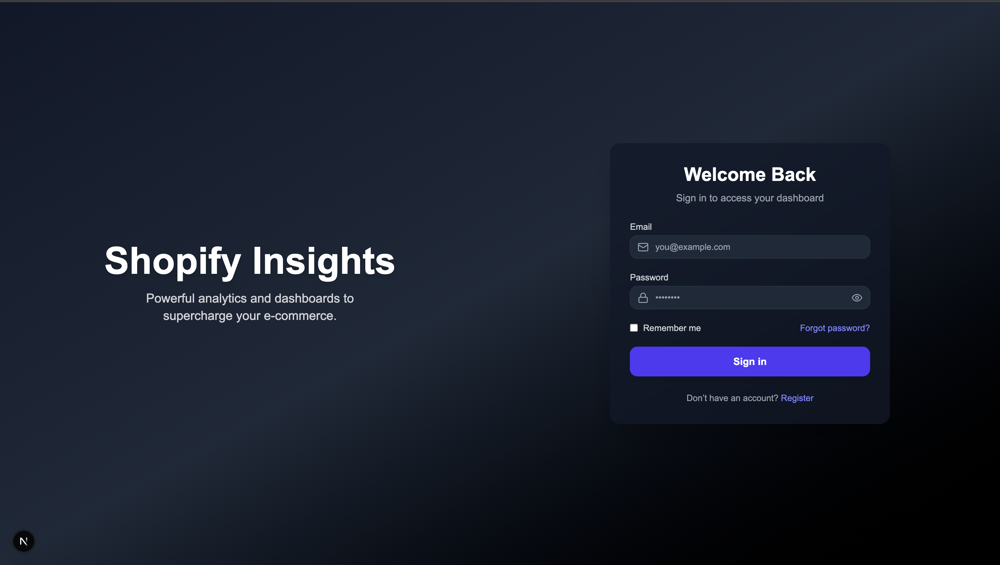
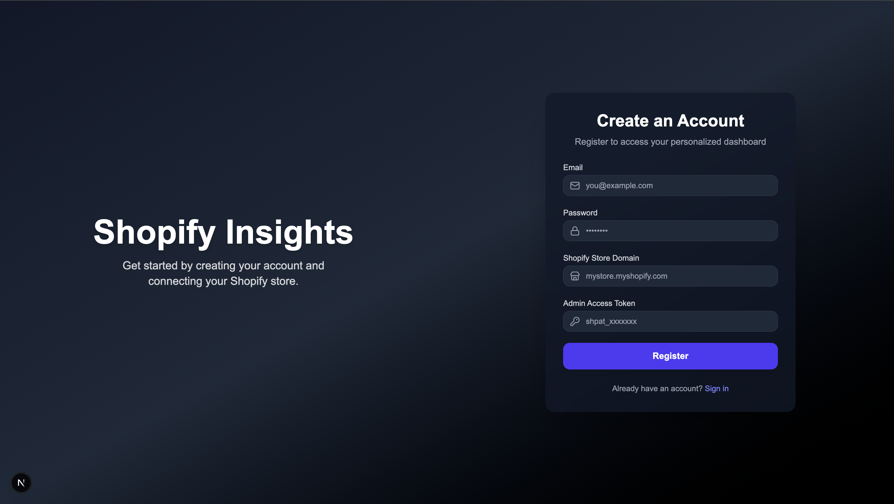
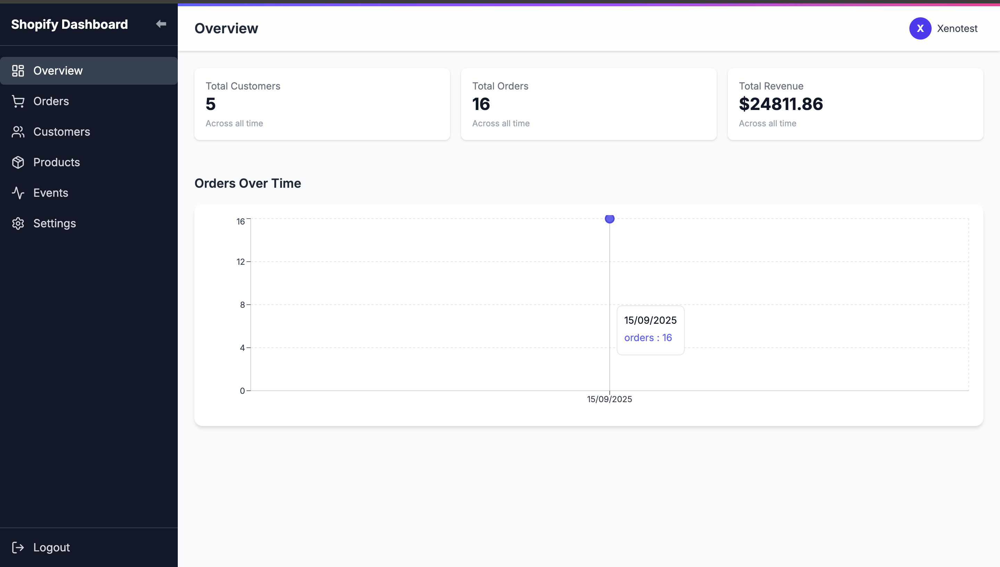
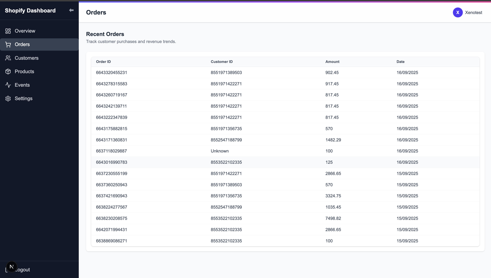
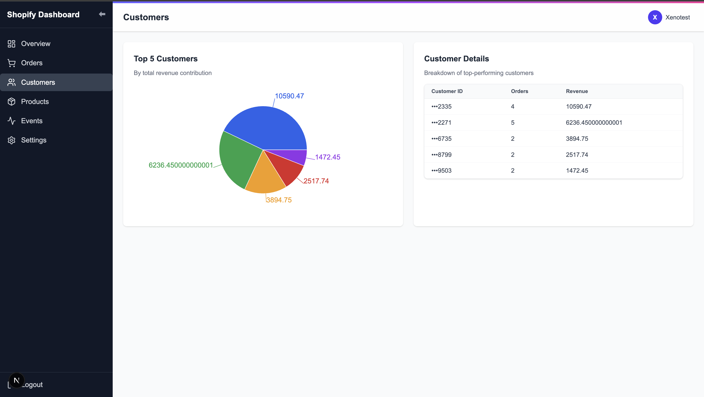
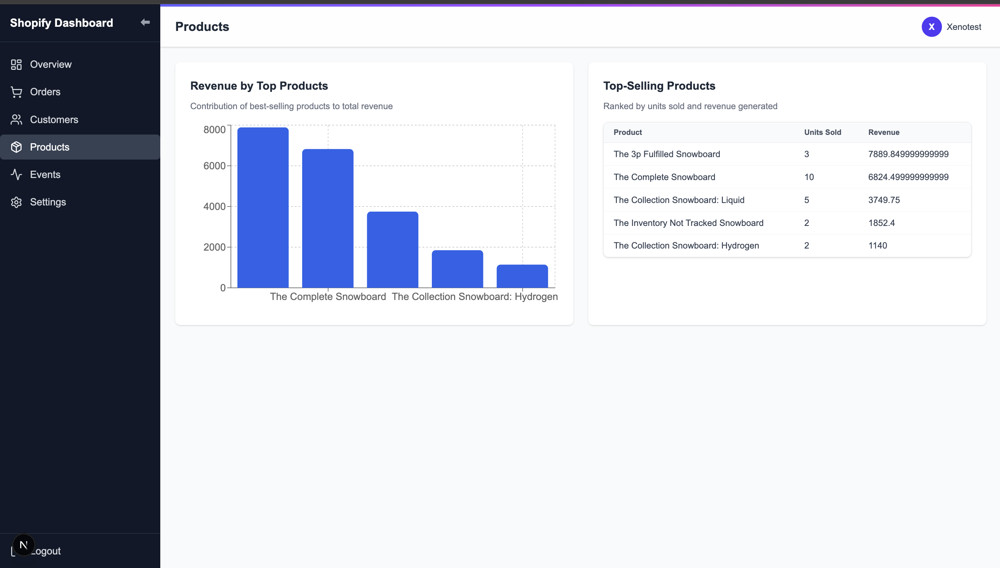
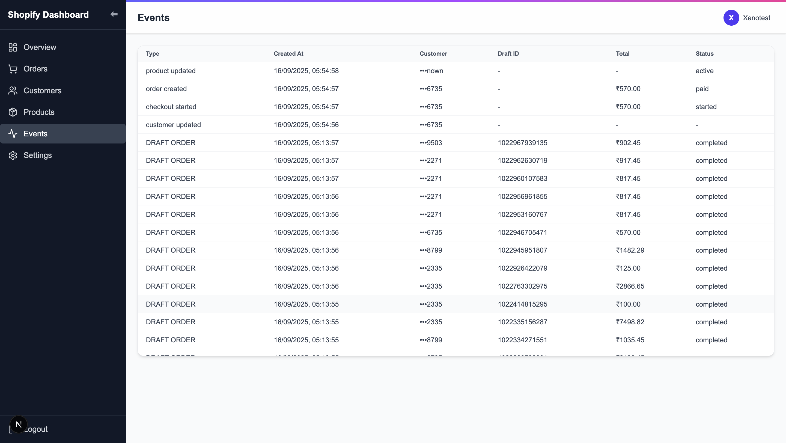
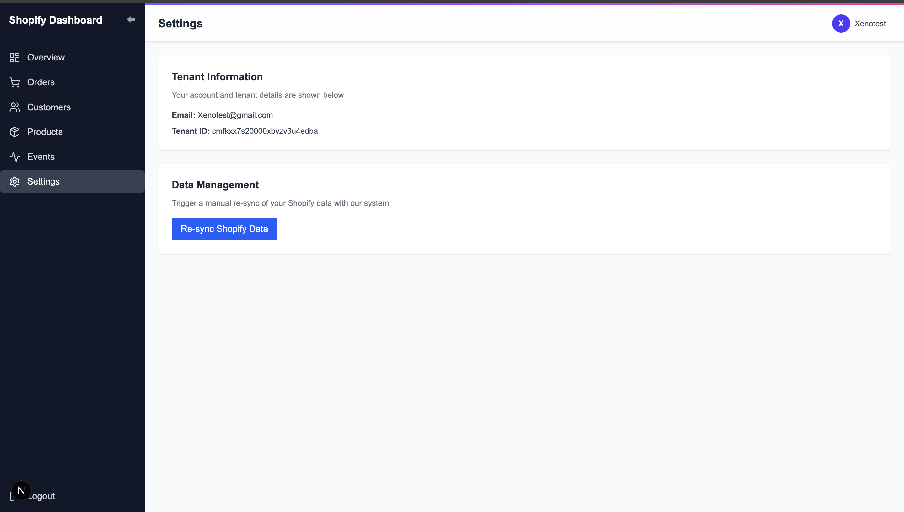

# 🖥️ TheInsights Frontend

The **Xeno Frontend** is a modern dashboard built using **Next.js + React**.  
It provides tenants with **authentication, data insights, and visualizations** for their Shopify store customers, orders, products, and events.


## 🖥️ TheInsights – Frontend Architecture

```mermaid
flowchart TD
    subgraph Frontend["TheInsights Frontend (Next.js + React)"]
        UI[Pages & Components] --> Router[Next.js Router]
        Router --> State[State Management / React Hooks]
        State --> APIClient[API Client]
        APIClient --> Env[Environment Config (.env.local)]
    end

    subgraph Backend["Backend APIs"]
        Auth[/Auth API/]
        Insights[/Insights API/]
        Shopify[/Shopify Sync API/]
    end

    APIClient --> Auth
    APIClient --> Insights
    APIClient --> Shopify

    User[👤 Tenant User] --> UI
```
## 🌐 Frontend Deployment Info

| Service   | Link |
|-----------|------|
| 🖥️ Frontend | [https://theinsights.onrender.com](https://theinsights.onrender.com) |

---

## ⚙️ Frontend Tech Stack

| Tech | Description |
|------|-------------|
|  | [Next.js](https://nextjs.org/) – React-based frontend framework |
|  | [React](https://react.dev/) – Component-based UI |
|  | [Tailwind](https://tailwindcss.com/) – Utility-first CSS |
|  | [Recharts](https://recharts.org/en-US/) – Data visualizations |
|  | [Lucide Icons](https://lucide.dev/) – Modern icon library |

---

## 📸 Frontend Screenshots

### 🔐 Authentication
| Login | Register |
|-------|----------|
|  |  |

### 📊 Dashboard & Orders
| Dashboard | Orders |
|-----------|--------|
|  |  |

### 👥 Customers & 📦 Products
| Customers | Products |
|-----------|----------|
|  |  |

### ⚡ Events & ⚙️ Settings
| Events | Settings |
|--------|----------|
|  |  |

### 👤 Profile & 🏢 Tenant Info
| Profile | Tenant |
|---------|--------|
|  |  |


## 📦 Frontend Setup Instructions

### 1. Navigate to frontend
```bash

```
cd frontend
```

2. Install dependencies
```
npm install
```
3. Start development server
```
npm run dev
```


4. Configure environment variables

Create a .env.local file inside the frontend directory:

```
```
NEXT_PUBLIC_API_URL=https://theinsights-e7a0.onrender.com

```
This ensures the frontend communicates with the backend service.
📸 Frontend Screenshots
🔐 Authentication
Login	Register
	
📊 Dashboard & Orders
Dashboard	Orders
	
👥 Customers & 📦 Products
Customers	Products
	
⚡ Events & ⚙️ Settings
Events	Settings
	
👤 Profile & 🏢 Tenant Info
Profile	Tenant
